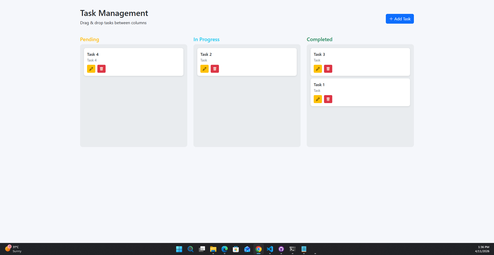
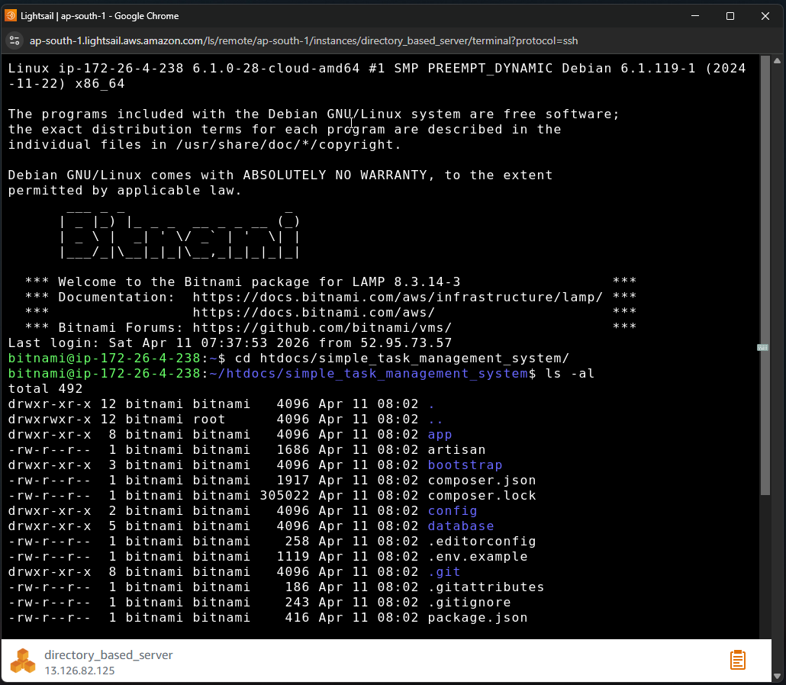

# Simple Task Management System

A sleek, efficient, and user-friendly Task Management System built with Laravel. This application features a dynamic Kanban board that allows users to organize their workflow through intuitive drag-and-drop actions.



## Features

- **Interactive Task Management Board**: Visualize your workflow with Pending, In Progress, and Completed columns.
- **Drag & Drop**: Effortlessly move tasks between stages using [SortableJS](https://sortablejs.github.io/Sortable/).
- **Task CRUD**: Create, view, edit, and delete tasks with a seamless modal interface.
- **Real-time Updates**: Status changes are persisted instantly via AJAX.
- **Responsive Design**: Fully responsive UI built with Bootstrap 5.
- **Modern Notifications**: Beautiful alerts and confirmations using SweetAlert2.

## Tech Stack

- **Backend**: [Laravel 10](https://laravel.com/) (PHP)
- **Frontend**: Blade Templates, [Bootstrap 5](https://getbootstrap.com/), [jQuery](https://jquery.com/)
- **Libraries**: [SortableJS](https://sortablejs.github.io/Sortable/), [SweetAlert2](https://sweetalert2.github.io/)
- **Database**: MySQL / SQLite (database-agnostic migrations)

## Prerequisites

- PHP >= 8.1
- Composer
- Node.js and NPM
- MySQL or SQLite

## Local Installation

1. **Clone the repository**
   ```bash
   git clone https://github.com/yourusername/simple-task-management-system.git
   cd simple-task-management-system
   ```

2. **Install dependencies**
   ```bash
   composer install
   npm install
   ```

3. **Environment setup**
   ```bash
   cp .env.example .env
   php artisan key:generate
   ```
   Configure your database settings in the `.env` file.

4. **Run migrations**
   ```bash
   php artisan migrate
   ```

5. **Compile assets**
   ```bash
   npm run build
   ```

6. **Start the server**
   ```bash
   php artisan serve
   ```
   Visit `http://localhost:8000` in your browser.

## Deployment (AWS Bitnami LAMP)



To deploy this application on an **AWS Bitnami LAMP** stack, follow these specific steps:

1. **Clone to the projects directory**
   We recommend cloning outside the default `htdocs` for better security:
   ```bash
   cd /opt/bitnami/projects
   sudo git clone https://github.com/yourusername/simple-task-management-system.git
   cd simple-task-management-system
   ```

2. **Environment and dependency setup**
   Create your environment file and install dependencies:
   ```bash
   sudo cp .env.example .env
   sudo composer install
   sudo php artisan key:generate
   ```
   Edit `.env` to configure your production database.

3. **Configure permissions**
   Laravel requires write access to specific directories. Bitnami uses the `daemon` user for Apache:
   ```bash
   sudo chmod -R 777 storage bootstrap
   sudo chown -R 777 storage
   ```

4. **Restart Apache**
   ```bash
   sudo /opt/bitnami/ctlscript.sh restart apache
   ```

5. **Production environment tweaks**
   Ensure your `.env` has:
   ```env
   APP_ENV=production
   APP_DEBUG=false
   ```
   Then run:
   ```bash
   php artisan config:cache
   php artisan route:cache
   php artisan view:cache
   ```

## Usage

1. **Add Task**: Click the "Add Task" button to create a new task with a title and description.
2. **Manage Status**: Drag task cards between columns to update their progress.
3. **Edit/Delete**: Use the icons on each card to modify task details or remove them permanently.

## Running Tests

The project includes both `Feature` and `Unit` tests to help verify core behavior and reduce regressions as the app evolves.

Run the full test suite with:

```bash
php artisan test
```

Run a specific suite when you only want part of the coverage:

```bash
php artisan test --testsuite=Feature
php artisan test --testsuite=Unit
```

The current automated tests cover areas such as:

- authentication flows
- email verification and password reset/update
- profile management
- task controller behavior, including:
  - redirecting the home route to the task board
  - loading the task index page successfully
  - returning task data as JSON for AJAX requests
  - redirecting non-AJAX task fetch requests
  - creating tasks and validating required fields
  - updating task details and status
  - deleting tasks successfully

The test configuration is defined in `phpunit.xml`, which already includes separate `Feature` and `Unit` suites. If you want isolated database settings for automated tests, update the testing database configuration there before running the suite.
